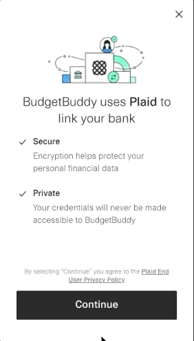
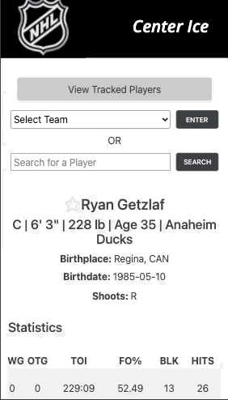

I am a full-stack web developer located in Southern California 🌞 🌴

I have always been interested in the world of tech and when I decided to start dabbling in the programming world through 
free resources on the internet, it did not take long for me to become completely hooked. My love for creativity and complex 
problem-solving, along with an eagerness to continually learn has led me to develop a passion for coding. One of my favorite 
things about coding is being able to watch an abstract idea become a tangible product that was built completely from 
scratch in just a short period of time!

### Technologies & Tools

     

     

### Applications 

#### BudgetBuddy 

A web application for anyone who wants to become a master at saving their money. BudgetBuddy allows you to connect to your bank account, so you can easily create a budget and deduct bank transactions from your budget all in one place. 

[Live Demo](https://center-ice-app.onrender.com/) | [Source Code](https://github.com/codywiseman/budget-buddy)

 

#### Center Ice

An application that allows hockey fanatics to browse NHL teams and players. Users can select their favorite players and track their statistics through the season.

[Live Demo](https://codywiseman.github.io/ajax-project/) | [Source Code](https://github.com/codywiseman/ajax-project) 

  

### Contact me 📬

cjwiseman09@gmail.com | [LinkedIn](https://www.linkedin.com/in/cody-wiseman1) | [Resume](https://drive.google.com/file/d/1QV4f4n4EjAg-uGgQyvl48_fU1DN6n02I/view?usp=sharing)

